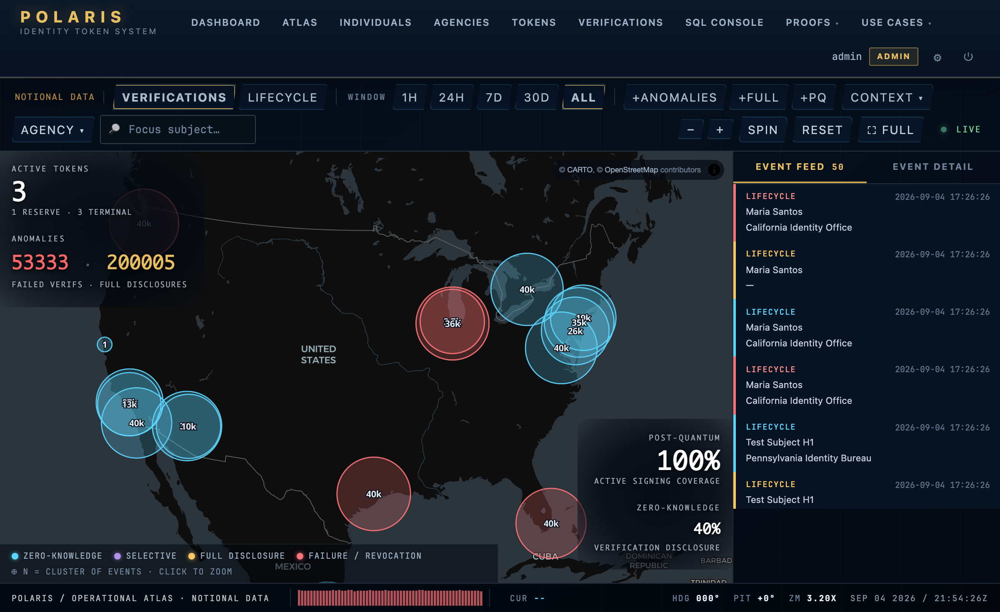

<div align="center">


# POLARIS

**A working reference implementation of a post-quantum, zero-knowledge,<br>compulsion-resistant national identity system.**

Educational project; notional data only. It is not a slide deck: CI boots the full production stack on every push.

[](https://github.com/EgorKhaklin/polaris-id/actions/workflows/ci.yml)
[](https://github.com/EgorKhaklin/polaris-id/releases/latest)
[](LICENSE)

[**Project site**](https://egorkhaklin.github.io/polaris-id/) · [What it is](#what-polaris-is) · [The ten guarantees](#the-ten-guarantees) · [The hard parts](#the-hard-parts) · [Architecture](#architecture) · [Run it](#run-it) · [Documentation](#documentation)

<br>



<sub>**The Atlas**, the operational surface: a globe that zooms from orbit to the street, plotting every verification and lifecycle event where it happened. Zero-knowledge verifications never appear. They carry no location, by construction.</sub>

</div>

---

## What Polaris is

Americans carry six to eight credentials that do not talk to each other: driver's license, passport, Social Security card, Real ID, voter registration, insurance card. Each is a separate artifact, signed by a separate authority, secured to a separate standard, with no shared revocation path and no shared audit trail.

Polaris consolidates them into **one physical token per person**, signed under post-quantum cryptography (ML-DSA-65, FIPS 204), verified through **context-scoped events** (banking, voting, and healthcare are different events with different disclosure rules) at three disclosure levels. The default level is **zero-knowledge**: the typical verification stores no token identifier at all, so the verification graph cannot be reconstructed even by someone holding the whole database.

This repository is the complete working system: a 28-table PostgreSQL schema whose constraints are the security boundary, a Flask application covering every use case, a Rust ZK-SNARK prover with an independent second witness, an operator CLI, a hardened production container stack behind a post-quantum TLS edge, and a flat layer of 77 machine-checked invariants that gates every change in CI.

What holds it together is one design rule: **the guarantees live in the database, not in application code**. A rule enforced by a trigger, a CHECK constraint, or a unique index binds every client, survives every restore from backup, and cannot be bypassed by the next caller. Application-level policy can be skipped; schema-level structure cannot.

---

## The ten guarantees

Above the ten sits the project's vocation: **no person can be compelled to renounce, transfer, or surrender their identity against their will.** Features that drift toward surveillance or population-scale aggregation are refused, and the refusal is structural: the schema carries no attribute to filter a population by.

| # | Guarantee | Enforced by |
|---|---|---|
| **C1** | The audit trail is append-only. History cannot be rewritten or deleted. | Database triggers reject `UPDATE`/`DELETE` on audit tables |
| **C2** | A zero-knowledge verification stores no token identifier. | Bidirectional `CHECK` constraint |
| **C3** | One person holds at most one ACTIVE token at any moment. | Partial unique index |
| **C4** | Failed-login counting is atomic. No check-then-act race. | Single-statement `UPDATE ... RETURNING` |
| **C5** | No inline scripts. Content-Security-Policy is `script-src 'self'`. | HTTP response header, verified per route |
| **C6** | Disclosure level is enforced server-side. A client cannot upgrade what it learns. | Server code paired with redaction tests |
| **C7** | No hardcoded cryptography. Algorithms are rows in a registry table. | Foreign key to `CryptographicAlgorithm` |
| **C8** | Every map/API aggregate is bounded. No unbounded result sets. | Hard caps in the SQL functions |
| **C9** | Concurrency claims are tested with real threads, not mocks. | Threaded test suites against a live database |
| **C10** | Identity is not money. The schema carries no monetary claim. | Structural absence, pinned by a check |

Each guarantee is machine-checked by [`polaris_checks`](polaris_checks/): 77 plain `check_*` functions, each paired with a detection test proving it fails on a broken fixture. A check that cannot detect its own violation is treated as broken. The reasoning for why these ten, and why they interlock, is in [MISSION.md](MISSION.md) and [meta/constraint-lattice.md](meta/constraint-lattice.md).

---

## The hard parts

Consolidating cards is the easy half. The hard half is what happens when an adversary shows up. Six threats are answered by construction, at the database layer, not in policy documents.

| Threat | In practice | The answer | Detail |
|---|---|---|---|
| **Cryptographic compulsion** | "Sign this or I break your fingers." | A second secret produces an indistinguishable verification that silently records a `DuressEvent`. Every operator-visible surface shows success. | [duress-codes](DEVNOTES/ships/duress-codes.md) |
| **Catastrophic loss** | Token lost; the holder has nothing to prove who they are. | A two-phase recovery ceremony with independent out-of-band channels, a cooldown, and an admin-gated completion. | [recovery-ceremony](DEVNOTES/ships/recovery-ceremony.md) |
| **Quantum migration** | Today's signatures break when a quantum computer arrives. | Tokens carry classical and post-quantum signatures simultaneously during cutover, with a database rule that exactly one is active. The default is already post-quantum. | [multi-sig-migration](DEVNOTES/ships/multi-sig-migration.md) |
| **Issuer concentration** | One agency issues tokens that pass as another agency's. | Explicit-only federation, no transitive trust. Every cross-agency verification gates on an active trust attestation row. | [federation](DEVNOTES/ships/federation.md) |
| **Auditability vs. privacy** | "Prove this token was in the ledger" without revealing which one. | A Plonky2 ZK-SNARK over a Merkle commitment answers membership and nothing else. | [zk-snark](DEVNOTES/ships/zk-snark.md) |
| **Issuer overreach** | An agency revokes tokens at industrial scale, outside policy. | A per-agency revocation-rate ceiling enforced by trigger and audited under an advisory lock. | [issuer-discretion](DEVNOTES/ships/issuer-discretion.md) |

---

## Architecture

Four layers. The schema is the core; everything else is a client of it.

```
      ┌───────────────────────────────────────────────────────────┐
      │  CHECK LAYER          polaris_checks: 77 flat invariant   │
      │                       checks; gates CI; reads everything, │
      │                       writes nothing                      │
      └────────────────────────────┬──────────────────────────────┘
                                   │
      ┌────────────────────────────▼──────────────────────────────┐
      │  APPLICATION          Flask, 72 routes: every use case,   │
      │                       the Atlas, WebAuthn MFA, /metrics   │
      │                       polaris_cli: the same over a shell  │
      └──────────┬──────────────────────────────┬─────────────────┘
                 │                              │ subprocess
      ┌──────────▼─────────────┐   ┌────────────▼─────────────────┐
      │  SCHEMA  PostgreSQL 16 │   │  ZK PROVER  Rust + Plonky2   │
      │  28 tables, 11 stored  │   │  Merkle-inclusion SNARK,     │
      │  procedures, append-   │   │  re-verified bit-for-bit by  │
      │  only audit triggers   │   │  an independent Python       │
      │  (the security         │   │  second witness              │
      │  boundary)             │   └──────────────────────────────┘
      └──────────┬─────────────┘
                 │ signs under
      ┌──────────▼────────────────────────────────────────────────┐
      │  SIGNATURES           ML-DSA-65 default (FIPS 204),       │
      │                       SLH-DSA hedge (FIPS 205), algorithm │
      │                       registry: rotation is a row, not a  │
      │                       redeploy                            │
      └───────────────────────────────────────────────────────────┘
```

| Component | What it is |
|---|---|
| [`polaris_sql/`](polaris_sql/) | The core. Schema, stored procedures implementing the use cases, append-only triggers, migrations. Business logic lives here so every client inherits it. |
| [`polaris_web/`](polaris_web/) | Flask application: dashboard, the Atlas, per-use-case flows, WebAuthn operator MFA, health and metrics. |
| [`polaris_zk/`](polaris_zk/) | Plonky2 Merkle-inclusion prover (Rust), plus [`witness2/`](polaris_zk/witness2/), an independent Python reimplementation that must agree with it. |
| [`polaris_cli/`](polaris_cli/) | Operator CLI: issuance, revocation, recovery, audit queries, without a browser. |
| [`polaris_checks/`](polaris_checks/) | The invariant layer. 77 checks, each with a tested failure mode. `python3 -m polaris_checks.run` gates CI. |
| [`scripts/`](scripts/), [`deploy/`](deploy/) | Operator tooling (backup, restore, archive, purge, migrate, recover-admin) and observability config. |

The production topology is five services: a self-built Caddy TLS edge, gunicorn, PgBouncer, PostgreSQL with pgBackRest WAL archiving, and Redis. Every service runs as non-root with all Linux capabilities dropped.

---

## Cryptography

The signing default is post-quantum **on day one**. There is no "migrate when quantum arrives" deferral; the migration target is the current default.

```
algorithm        family     PQ    NIST         sec    public key    signature
─────────────────────────────────────────────────────────────────────────────
ML-DSA-65        ML-DSA      ✓    FIPS 204     192      1,952 B      3,309 B   default
ML-DSA-87        ML-DSA      ✓    FIPS 204     256      2,592 B      4,627 B   high-assurance
SLH-DSA-128s     SLH-DSA     ✓    FIPS 205     128         32 B      7,856 B   hash-based hedge
SLH-DSA-256s     SLH-DSA     ✓    FIPS 205     256         64 B     29,792 B   hash-based, max
ECDSA-P256       ECDSA            FIPS 186-4   128         64 B         72 B   legacy, sunset 2027
```

- **Two independent witnesses for every cryptographic verdict.** Real ML-DSA-65 signatures verified through liboqs are cross-checked by a second implementation (OpenSSL via `cryptography`); the ZK epoch root computed by the Rust prover is recomputed bit-for-bit by a Python second witness. No single crypto library is trusted alone. A verdict that cannot be double-checked abstains rather than pretending.
- **SLH-DSA is a diversity hedge.** ML-DSA rests on lattice assumptions, SLH-DSA on hash functions alone; if one family falls, the other stands. The cost is signature size, carried openly.
- **The TLS edge negotiates post-quantum key exchange.** The public edge speaks X25519MLKEM768 hybrid KEX with capable clients, and CI proves the handshake on every push. What remains classical (internal TLS hops, certificates, WebAuthn) is mapped honestly in [PQC-POSTURE.md](docs/reference/PQC-POSTURE.md).
- **The ZK proof is transparent.** Plonky2 is FRI-based: no trusted setup. The proof answers "was this token in the ledger at epoch N" and nothing else. Source: [`polaris_zk/src/lib.rs`](polaris_zk/src/lib.rs).

---

## Verified, not asserted

Every claim above is backed by a gate that fails if the claim stops being true. Counts measured at v9.157.

| Layer | Scale | What it proves |
|---|---|---|
| Product tests (live database) | 571 | Every CHECK constraint, every use case, every route, redaction at every read path, concurrency with real threads |
| Crypto witnesses | 50 | ML-DSA-65 sign/verify against both witnesses; the Rust and Python epoch roots agree |
| Invariant checks | 77 | C1-C10 plus production posture, each check paired with a detection test |
| CI jobs | 7 | See below |

The CI jobs do not just run tests; they exercise the artifacts. On every push, CI **builds and boots the dev and prod images**, **boots the five-service production stack end to end** and asserts health through the TLS edge, **round-trips an encrypted backup and restore** with a fail-closed negative check, **proves the post-quantum TLS handshake** against a real certificate, **signs and verifies with real ML-DSA-65** inside the production image, and **gates on CVE scans** of both the Python dependency surface and all four self-built container images.

Most of those jobs carry a comment naming the specific past failure they exist to prevent. The pattern behind them: every defect class found by running the system, rather than reading it, gets a permanent gate.

```bash
python3 -m polaris_checks.run      # the invariant layer, no database needed
./scripts/ai-test.sh               # the full product suite against local Postgres
./polaris_mac_launch.sh test       # the same, via the launcher
```

---

## Run it

**Local (macOS).** The only prerequisite is [Docker Desktop](https://www.docker.com/products/docker-desktop).

```bash
git clone https://github.com/EgorKhaklin/polaris-id.git polaris
cd polaris
./Polaris.command
```

The first run pulls PostgreSQL, builds the app image, loads the schema, runs the SQL self-tests, and opens `http://localhost:2222`. Closing the browser tab tears the stack down. Three seeded roles (notional data, development credentials only):

```
admin     Admin@123!      full access, SQL console
operator  Operator@123!   issue, activate, bind tokens
auditor   Auditor@123!    read-only, warrant audits, duress dashboard
```

**Production (any Docker host).**

```bash
./scripts/polaris-generate-secrets.sh
export POLARIS_DOMAIN=polaris.example.com
./scripts/polaris-deploy.sh prod
curl -fsS https://$POLARIS_DOMAIN/api/health
```

On a fresh Debian, Ubuntu, or RHEL-family server, one script does all of the above under systemd: `sudo POLARIS_DOMAIN=polaris.example.com deploy/linux/install.sh` ([LINUX-SERVER](docs/operator/LINUX-SERVER.md), then [HARDENING](docs/operator/HARDENING.md)). Caddy provisions TLS automatically; `/api/health` reports structured per-component status. Runbooks: [INSTALL](docs/operator/INSTALL.md) · [OPERATIONS](docs/operator/OPERATIONS.md) · [SECRETS](docs/operator/SECRETS.md) · [DR](docs/operator/DR.md) · [FAILOVER](docs/operator/FAILOVER.md). Diagnostics: `./polaris_mac_launch.sh doctor`; full launcher reference: `./polaris_mac_launch.sh --help`.

---

## Where Polaris sits

| System | National-scope issuance | Post-quantum default | Zero-knowledge default | Compulsion-resistant primitive | Append-only audit at schema |
|---|:---:|:---:|:---:|:---:|:---:|
| Real ID (US) | ✓ | ✗ | ✗ | ✗ | ✗ |
| mDL / ISO 18013-5 | ✓ | ✗ | partial | ✗ | ✗ |
| Aadhaar (India) | ✓ | ✗ | ✗ | ✗ | partial |
| e-Estonia | ✓ | ✗ | ✗ | ✗ | partial |
| W3C DIDs / VCs | ✗ | method-dependent | ✓ | ✗ | n/a |
| **Polaris** | ✓ | ✓ | ✓ | ✓ | ✓ |

No single row is novel. The contribution is the assembly: all five properties in one running system, every one enforced at the schema level and machine-checked, rather than asserted in prose. The closest deployed relative is mDL, which has selective disclosure and real signatures but no post-quantum default, no duress primitive, and no constitutional layer governing the issuer itself.

---

## Documentation

| If you are | Start with |
|---|---|
| Deciding whether this is worth your time | [MISSION.md](MISSION.md), the constitution: what the system refuses to do and why |
| Reviewing the architecture | [ARCHITECTURE-OVERVIEW](docs/ARCHITECTURE-OVERVIEW.md) · [SYSTEM-MAP](docs/reference/SYSTEM-MAP.md) · [PRINCIPLES](docs/story/PRINCIPLES.md) |
| Reading the security posture | [SECURITY.md](SECURITY.md) · [PQC-POSTURE](docs/reference/PQC-POSTURE.md) · [RED-TEAM-SCOPE](docs/RED-TEAM-SCOPE.md) · [threat model](DEVNOTES/threat-model.md) |
| Integrating against it | [API](docs/reference/API.md) · [DATA-MODEL](docs/reference/DATA-MODEL.md) · [GLOSSARY](docs/reference/GLOSSARY.md) |
| Operating a deployment | [docs/operator/](docs/operator/README.md), twelve runbooks from install to disaster recovery |
| Reading it as an academic artifact | [The project report](docs/paper/polaris_project_report.pdf) (PDF, same license) |
| Working on the code, human or AI agent | [CONTRIBUTING.md](CONTRIBUTING.md) · [CLAUDE.md](CLAUDE.md) · [CHANGELOG.md](CHANGELOG.md) |

---

## Scope, honestly

- **Educational reference implementation.** Built as a portfolio project for Seton Hill University, Spring 2026. Notional data only; not a deployed identity system, and the seeded credentials above are deliberately public.
- **Not production-ready, and says so.** The remaining gaps are operator decisions (HSM key custody, offsite backup target, alerting backend, legal review, external penetration test), not missing code. The honest ledger is [PRODUCTION-READINESS.md](docs/PRODUCTION-READINESS.md).
- **Security disclosures** go through [SECURITY.md](SECURITY.md); `/.well-known/security.txt` ships with the stack.

---

## License

[Apache License 2.0](LICENSE). Copyright 2026 Egor Khaklin.

The license carries an explicit patent grant and attribution preservation. If you build on the code, the schema, or the patterns (audit-of-record discipline, the constraint lattice, the flat invariant-check layer), retain [LICENSE](LICENSE) and [NOTICE](NOTICE). Third-party attributions (Plonky2, MapLibre, Flask, and others) are in [NOTICE](NOTICE).

If you read one document after this one, read [MISSION.md](MISSION.md).
