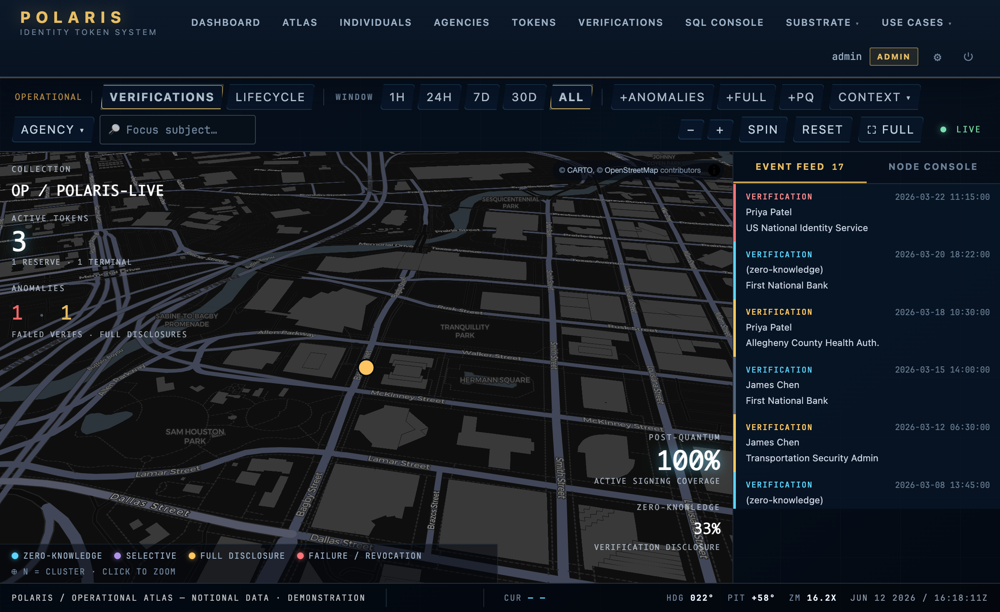
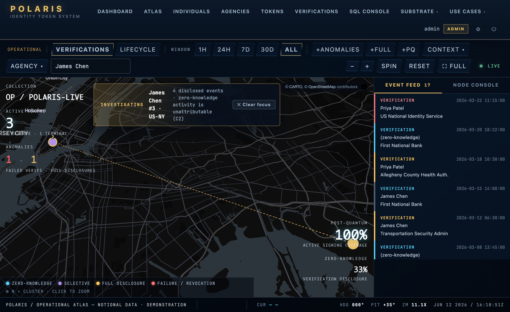

<div align="center">


# POLARIS

### A working national identity infrastructure.

_Post-quantum signed. Audit-of-record by construction. Compulsion-resistant by design._

> _Fixus inter mutabilia._ &nbsp; Fixed amid the mutable.

[](https://github.com/EgorKhaklin/polaris-id/actions/workflows/ci.yml)
[](https://github.com/EgorKhaklin/polaris-id/releases/latest)
[](https://github.com/EgorKhaklin/polaris-id/commits/main)

[](polaris_web/)
[](polaris_sql/)
[](polaris_zk/)
[](polaris_zk/src/lib.rs)
[](polaris_web/webauthn_auth.py)
[](docs/reference/PQC-POSTURE.md)

**[Project site](https://egorkhaklin.github.io/polaris-id/)** &nbsp;·&nbsp; post-quantum · zero-knowledge · compulsion-resistant &nbsp;·&nbsp; one double-click to launch

[**System map**](docs/reference/SYSTEM-MAP.md) · [**Constitution (MISSION.md)**](MISSION.md) · [**Backlog (ROADMAP.md)**](ROADMAP.md) · [**Audit-of-record (CHANGELOG.md)**](CHANGELOG.md) · [**Production readiness**](docs/PRODUCTION-READINESS.md) · [**Agent runbook (CLAUDE.md)**](CLAUDE.md)

**The system** &nbsp; [The hard parts](#the-hard-parts) · [Token model](#the-token-model) · [Architecture](#architecture) · [Cryptography](#cryptography) · [Production posture](#production-posture) · [How it differs](#how-it-differs-from-existing-identity-systems)

**Proof of life** &nbsp; [The Atlas](#the-atlas) · [Quickstart](#quickstart) · [What you get](#what-you-get) · [The trick](#the-trick) · [Tour](#tour) · [Tests](#tests) · [License](#license)

<br>


<sub>**The Atlas** — an operational globe that zooms from orbit to the street. Every reticle is a verification or lifecycle event. Zero-knowledge verifications never appear: they carry no location, by construction.</sub>

</div>

---

## What this is

Americans currently carry six to eight credentials that do not talk to each other: driver's license, passport, Social Security card, Real ID, voter registration, health insurance card, and a thickening pile of agency-specific identifiers. Each is a different artifact, signed by a different authority, secured to a different standard, with no shared revocation path and no shared audit trail.

Polaris consolidates them into **one physical token per person**, signed under post-quantum cryptography, with **context-scoped verification** (banking versus voting versus healthcare are different events with different disclosure rules) and **zero-knowledge defaults** (the typical verification stores no token identifier at all).

This repository is a **working reference implementation**: 28 schema tables, 11 stored procedures, a Flask application with 72 routes that exercises every use case, a Plonky2 ZK-SNARK prover in Rust with an independent second witness, WebAuthn-MFA operator authentication, a MapLibre operational atlas that zooms from a globe to street level, a production container stack behind a post-quantum TLS edge, and a self-healing macOS launcher that gets all of it running from a single double-click.

It is not a slide deck. It runs; CI boots the full production stack end to end on every push.

The system lives in [`polaris_sql`](polaris_sql/), [`polaris_web`](polaris_web/), [`polaris_cli`](polaris_cli/), [`polaris_zk`](polaris_zk/). Its C1-C10 invariants are machine-checked by [`polaris_checks`](polaris_checks/), a flat layer of plain check functions.

---

## The Atlas

The operational surface is a console, not a dashboard. It is a MapLibre globe that zooms continuously from orbit down to individual buildings, with every verification and lifecycle event plotted on the ground where it happened, fetched per-viewport so it stays fast whether the ledger holds a thousand events or a hundred million.

<table>
<tr>
<td width="50%"><br><sub><b>Zoom to the street.</b> The globe flattens into a 3D street map. An event sits on its exact coordinate; the live <code>CUR</code> readout streams the latitude and longitude under the cursor.</sub></td>
<td width="50%"><br><sub><b>Signal in the noise.</b> Warrant-grade subject focus (admin/auditor, audit-logged) isolates one named subject and draws a path of what they did. Their zero-knowledge verifications cannot be plotted, or even attributed: the privacy default survives the investigation.</sub></td>
</tr>
</table>

Three things make the Atlas more than eye candy:

- **It scales by construction.** The browser never receives the whole dataset. It computes the visible viewport, asks the server for per-cell aggregates, and renders those. Payload is proportional to what is on screen, never to the size of the ledger. That is constraint **C8**: every `/api/atlas/*` endpoint returns a bounded result set.
- **The privacy default is visible in the cartography.** A `ZERO_KNOWLEDGE` verification stores no token id and no location (C2), and is excluded from every spatial layer (C6). On the map, the privacy guarantee is not a footnote; it is the reason a whole class of events never appears.
- **Investigation is governed, not casual.** You can isolate one *known* subject (warrant-audit, UC-7, admin/auditor-only, every access written to the audit-of-record). You cannot filter the population by attribute, because the schema carries no attribute to filter by. The line between investigating a subject and profiling a people is drawn in the data model, not in a policy document.

---

## The hard parts

Consolidating the cards is the easy half. The interesting half is what happens when an adversary shows up. Polaris answers six of them by construction.

| The threat | What it looks like in practice | How Polaris answers it | Where |
|---|---|---|---|
| **Cryptographic compulsion** | "Sign this transaction or I break your fingers." The holder cannot refuse without injury. | A second secret produces an indistinguishable verification that silently records a DuressEvent. The operator's screen reveals nothing. | [duress-codes](DEVNOTES/ships/duress-codes.md) ‎  ‎ ‎  UC-12 |
| **Catastrophic loss** | Token lost, holder unidentified, no way to prove who they are without the artifact. | Two-phase recovery ceremony (initiate then complete) gated by four CHECK constraints and an admin-only second key. | [recovery-ceremony](DEVNOTES/ships/recovery-ceremony.md)   UC-9 |
| **Quantum migration** | Today's signing algorithms become broken overnight when a quantum computer arrives. | Multi-signature transitional state: a token can be signed under classical AND post-quantum algorithms simultaneously, with a hard rule that exactly one is active. | [multi-sig-migration](DEVNOTES/ships/multi-sig-migration.md)   UC-6 |
| **Issuer concentration** | One agency can issue tokens that masquerade as any other agency's. | Explicit-only federation: no transitive trust. Every cross-agency verification gates on an active AgencyTrustAttestation row. | [federation](DEVNOTES/ships/federation.md)  UC-10 |
| **Public auditability without privacy loss** | "Prove this token was in the ledger" without revealing which one. | Plonky2 ZK-SNARK over a Merkle commitment. The proof reveals nothing about the leaf. | [zk-snark](DEVNOTES/ships/zk-snark.md)  ‎     UC-11 |
| **Issuer overreach** | An agency revokes tokens at industrial scale outside policy. | Per-agency revocation-rate ceiling enforced by trigger. Sanctioned by the IssuerDiscretionPolicy row, audited by `pg_advisory_xact_lock`. | [issuer-discretion](DEVNOTES/ships/issuer-discretion.md)   UC-8 |

Every row has a defender's claim, an attacker's optimal play, an equilibrium analysis, a documented second-best attack, and an enforcement trace at the schema level.

---

## The token model

An IdentityToken is a row in Postgres. The physical card carries the cryptographic serial; the row carries everything else.

```
IdentityToken
├── token_value             VARCHAR(128)   UNIQUE      canonical cryptographic serial
├── physical_serial         VARCHAR(64)    UNIQUE      hardware serial of the card
├── hardware_model          VARCHAR(50)                manufacturer / model
├── biometric_binding_type  enum                       NONE · FINGERPRINT · FACE · IRIS
├── liveness_check_type     enum                       PASSIVE · ACTIVE_CHALLENGE · MULTI_MODAL
├── individual_id           → Individual               the person
├── issuing_agency_id       → Agency                   who issued it
├── algorithm_id            → CryptographicAlgorithm   ML-DSA-65 by default
├── predecessor_token_id    → IdentityToken (self)     the succession chain
├── activation_sequence     INTEGER ≥ 1                which token in the lineage
├── status                  enum                       ACTIVE · RESERVE · DORMANT · REVOKED · LOST · EXPIRED
├── issued_date · activated_date · expiration_date
└── duress_code_hash        VARCHAR(255) NULL          the second secret (optional)
```

The shape carries the policy. Four invariants worth naming:

- **One ACTIVE row per individual.** Enforced by a partial unique index on `(individual_id) WHERE status = 'ACTIVE'`, not by application logic. Replacing a token means walking the lineage forward, not opening a second row. That is constraint **C3** in the constitution, and it survives every restore from backup because it lives in the index, not in code.
- **Algorithm by reference, not literal.** The signing algorithm is a foreign key to `CryptographicAlgorithm`, a first-class entity carrying `quantum_resistant`, `nist_standard`, and `deprecation_date`. There is no hardcoded crypto anywhere in the codebase. Adding ML-DSA-87 tomorrow is `INSERT INTO`, not `git push`. That is constraint **C7**.
- **Succession is a chain, not an event.** `predecessor_token_id` is self-referential; the full lineage from a person's first issuance to their current token is one recursive CTE. Recovery, replacement, and post-quantum migration all add a new row pointing at the predecessor; nothing is overwritten.
- **Duress is observable only to the audit trail.** If a holder types the duress code under coercion, the verification looks identical to a normal one on every operator-visible surface. A `DuressEvent` row appears in the audit-of-record; the operator's screen reveals nothing. That is constraint **C6** plus the anti-coercion vocation working together.

The `CREATE TABLE` is in [`polaris_sql/01_schema.sql`](polaris_sql/01_schema.sql). Every column is documented; every CHECK constraint has a paired test.

---

## Architecture

Four layers. The check layer reads but never writes the operational layer. The ZK prover is a subprocess, not a service. WebAuthn FIDO2 is the only authentication path for human operators; passwords alone cannot reach the admin or auditor roles.

```
        ┌─────────────────────────────────────────────────────────────┐
        │                       CHECK LAYER                           │
        │   polaris_checks — 68 flat invariant checks                 │
        │   (C1-C10 · CSP · secrets posture · PQC wiring · CI proof   │
        │    pins · doc/schema drift · ZK two-witness · …)            │
        │   plain check_*(repo_root) functions; `run` gates CI        │
        └─────────────────────────┬───────────────────────────────────┘
                                  │   reads (no writes)
        ┌─────────────────────────▼───────────────────────────────────┐
        │                       APPLICATION                           │
        │     Flask (72 routes)  ·  Atlas globe  ·  WebAuthn MFA      │
        │     Dashboard  ·  /sql console  ·  structured /api/health   │
        └──────────┬──────────────────────────┬───────────────────────┘
                   │                          │
        ┌──────────▼─────────┐    ┌───────────▼──────────────────────┐
        │  SCHEMA (Pg 16)    │    │   ZK PROVER (Rust nightly)       │
        │  28 tables         │    │   Plonky2 SNARK · Merkle-incl.   │
        │  11 stored procs   │    │   + independent second witness   │
        │  9 AoR by trigger  │    │   /api/zk/epoch/close · /verify  │
        └──────────┬─────────┘    └──────────────────────────────────┘
                   │  signs with
        ┌──────────▼──────────────────────────────────────────────────┐
        │                 POST-QUANTUM SIGNATURES                     │
        │   ML-DSA-65 (FIPS 204, default)  ·  SLH-DSA (FIPS 205)      │
        │   ML-DSA-87 (high-assurance)  ·  ECDSA-P256 (legacy/audit)  │
        └─────────────────────────────────────────────────────────────┘
```

Each layer is independently buildable. The schema loads from `00_load_all.sql` against an empty Postgres. The application boots from `app.py` against the loaded schema. The ZK prover compiles under `cargo +nightly build --release` on the same machine. The check layer is a read-only set of plain functions that gate CI; it survives any operational restart unchanged.

The constraint that holds this together is **C1: audit-of-record**. Ten instances (nine schema, one filesystem) record every meaningful operation at the moment it happens. Nothing in the system reconstructs history after the fact; if it isn't written when it occurs, it doesn't exist.

---

## Cryptography

The signing-algorithm registry seeds with five rows. The operational default is **ML-DSA-65**: the NIST-standardized Module-Lattice Digital Signature Algorithm, FIPS 204, Level 3 security, finalized in 2024.

```
algorithm        family     PQ    NIST           sec   public-key   signature
─────────────────────────────────────────────────────────────────────────────
ML-DSA-65        ML-DSA      ✓    FIPS 204       192     1,952 B       3,309 B   ◀ default
ML-DSA-87        ML-DSA      ✓    FIPS 204       256     2,592 B       4,627 B   high-assurance
SLH-DSA-128s     SLH-DSA     ✓    FIPS 205       128        32 B       7,856 B   hash-based hedge
SLH-DSA-256s     SLH-DSA     ✓    FIPS 205       256        64 B      29,792 B   hash-based, max
ECDSA-P256       ECDSA            FIPS 186-4     128        64 B          72 B   LEGACY · sunsets 2027-12-31
```

Four things are worth noting:

- **The default algorithm is already post-quantum.** ML-DSA-65 is the algorithm new tokens are issued under on day one. There is no "we will migrate when quantum arrives" deferral; the migration target is the current default. Real ML-DSA-65 signature bytes are produced with `POLARIS_USE_REAL_PQC=1` via [liboqs](https://github.com/open-quantum-safe/liboqs); with the flag off the default build records a deterministic placeholder so property tests stay reproducible without liboqs installed. ECDSA-P256 is retained only because pre-PQ audit queries need to resolve the algorithm by foreign key.
- **Two independent witnesses verify every real signature.** Since v9.133, ML-DSA-65 signatures verified through liboqs are cross-checked by a second, independent implementation (OpenSSL 3.5 via `cryptography`). A signature is accepted when both witnesses agree; no single crypto library is trusted alone. The same discipline covers the ZK epoch root, which a separate Python implementation recomputes bit-for-bit against the Rust prover.
- **The TLS edge negotiates a post-quantum key exchange.** The public edge (Caddy, self-built with the rate-limit plugin) negotiates **X25519MLKEM768** hybrid KEX with capable clients; the `caddy-edge` CI job proves the handshake on every push against a real certificate. The full honest map of what is and is not post-quantum (token signatures and hashing are; certificates and WebAuthn remain classical pending NIST timelines) lives in [PQC-POSTURE.md](docs/reference/PQC-POSTURE.md).
- **SLH-DSA is a diversity hedge.** ML-DSA rests on lattice problems, SLH-DSA on hash-function security alone. If one family is broken the other is independent. The cost of the hedge is signature size: 29.8 KB for SLH-DSA-256s versus 3.3 KB for ML-DSA-65. Polaris treats post-quantum signature size as a property of the artifact, not a problem to optimize away.

**Migration (UC-6 · `/uc6/migrate-algorithm`)** is a multi-signature transitional state. A token can carry both a classical and a post-quantum signature simultaneously during cutover, with a database-enforced rule that exactly one is operationally active. The cutover writes a `KeyMigration` row the audit trail can replay.

The zero-knowledge surface is independent of the signing algorithm. **Plonky2** in [`polaris_zk/src/lib.rs`](polaris_zk/src/lib.rs) proves Merkle-tree inclusion against epoch commitments published at `/epochs`. The proof reveals nothing about the leaf; it answers only "was this token in the ledger at epoch N". The Rust binary is a subprocess called by [`polaris_web/zk.py`](polaris_web/zk.py); the Flask app degrades gracefully without it (every page serves, every UC-1..UC-12 flow works; only `/api/zk/epoch/close` and `/api/zk/verify` go quiet).

---

## Production posture

Arc B (May-June 2026) closed the gap between architectural sophistication and operational reality. The complete production stack ships in the repo and **CI boots it end to end on every push**; that job alone surfaced four prod-down bugs the day it landed, which is the point.

```
            client ── TLS 1.3 (X25519MLKEM768 hybrid KEX) ──▶ caddy (self-built edge)
                                                                │  rate limiting · HSTS
                                                                ▼
            gunicorn/Flask (non-root, all capabilities dropped) ─▶ pgbouncer ── verify-ca TLS ──▶ postgres 16
                                                                                 │ streaming replication ─▶ standby
                                                                                 └ pgBackRest WAL archiving ─▶ DR restore
```

What that means concretely:

- **TLS everywhere it can be.** Let's Encrypt at the edge with automatic provisioning; certificate-pinned (`verify-ca`) TLS on the pgbouncer-to-postgres hop. Internal hops stay classical until OpenSSL 3.5 reaches those images; [PQC-POSTURE.md](docs/reference/PQC-POSTURE.md) tracks the gap honestly.
- **Hardened containers.** Every production service runs as a non-root user with all Linux capabilities dropped; images apt/apk-upgrade their bases and **Trivy gates CI on fixable CRITICAL CVEs** in both dependency and image scans.
- **Backups and DR that are exercised, not asserted.** pgBackRest WAL archiving, a scripted restore, and a CI job that runs a full backup/restore round-trip. Runbooks: [DR.md](docs/operator/DR.md), [FAILOVER.md](docs/operator/FAILOVER.md), [RUNBOOKS.md](docs/operator/RUNBOOKS.md), [SLOS.md](docs/operator/SLOS.md).
- **Observability.** Structured JSON logs with correlation IDs, Prometheus metrics, alert rules in [`deploy/observability/`](deploy/), and a structured `/api/health` that reports per-component status.
- **Privacy machinery.** Right-to-erasure via audited pseudonymization (the audit-of-record stays intact; the person disappears from it), retention/archive tooling, and ZK verification that never stored the link in the first place.

The honest gap ledger lives in [docs/PRODUCTION-READINESS.md](docs/PRODUCTION-READINESS.md): what is done, what is operator-gated (S3 offsite repo, standby host, HSM custody, pager backend, legal review), and what is third-party-gated.

---

## How it differs from existing identity systems

There is no shortage of identity infrastructure in the world. The question is what Polaris does that the existing deployed systems do not.

| System | National-scope issuance | Post-quantum operational default | Zero-knowledge default | Compulsion-resistant primitive | Append-only AoR at schema |
|---|:---:|:---:|:---:|:---:|:---:|
| **Real ID** (US, 2005 act, fully enforced 2025) | ✓ | ✗ | ✗ | ✗ | ✗ |
| **mDL / ISO 18013-5** (mobile driver's license) | ✓ | ✗ | partial | ✗ | ✗ |
| **Aadhaar** (India, 1.3B+ enrolled) | ✓ | ✗ | ✗ | ✗ | partial |
| **e-Estonia** (e-ID + e-Residency) | ✓ | ✗ | ✗ | ✗ | partial |
| **W3C DIDs / VCs** (spec, decentralized) | ✗ | method-dependent | ✓ | ✗ | n/a |
| **Polaris** (this repo) | ✓ | ✓ ML-DSA-65 | ✓ Plonky2 + R6 redaction | ✓ DuressEvent | ✓ 9 schema instances |

A few of the contrasts are worth narrating instead of tabling.

**Real ID** standardizes the document and the source-of-truth check. It does not standardize a verification protocol; the card is signed by the printer, not by a key. There is no cryptographic identity at all, no shared revocation path, and no audit trail beyond what each individual DMV chooses to retain.

**mDL (ISO/IEC 18013-5)** is the closest deployed system in spirit. It already does selective disclosure ("prove the holder is over 21 without revealing their address") and is signed cryptographically. What mDL does not do today is post-quantum signatures, a formal compulsion-defense primitive, or a constitutional layer governing how the issuer itself behaves over time.

**Aadhaar** has biometric binding at national scale; its strength is also its weakness. The biometric templates live in a centralized authority and can be queried by it. Polaris treats biometric binding as a per-token attribute with an explicit enrollment witness agency, not as a population-scale biometric database. The system can answer "is this token bound to a fingerprint" without ever holding the fingerprint outside the holder's possession.

**W3C DIDs and Verifiable Credentials** are spec, not system. They support the verification model Polaris uses (cryptographic identifiers, selective disclosure, federation-by-attestation), but they do not address national-scope issuance, biometric binding, or the operational substrate an issuing authority would need to actually run one. Polaris fills the substrate; it could in principle emit VCs as a representation format.

**e-Estonia** is the existing deployed system most similar in ambition. Its cryptography is classical (ECDSA on the e-ID card, RSA in older infrastructure); a platform-level migration path to post-quantum is not yet specified. The system has no compulsion-defense primitive at the protocol level.

Polaris's contribution is not novelty in any single primitive. It is the **assembly**: a national-scope issuance model, a post-quantum operational default, zero-knowledge defaults on verification, a duress-code primitive built into the verification flow, and an append-only audit-of-record enforced at the database trigger level; every one of which is machine-checked at the schema level rather than asserted in prose.

---

## Quickstart

**Local (macOS).** You need [Docker Desktop](https://www.docker.com/products/docker-desktop). That is the only prerequisite.

```bash
git clone https://github.com/EgorKhaklin/polaris-id.git polaris
cd polaris
./Polaris.command            # or: ./polaris_mac_launch.sh up
```

The first run pulls Postgres 16, builds the Flask image, loads the schema, runs the SQL self-tests, and opens your browser at `http://localhost:2222`. Subsequent launches take roughly ten seconds. Close the browser tab to stop; the launcher watches the page and tears the stack down automatically.

Sign in with one of three seeded roles (notional data only):

```
admin     ·  Admin@123!     full access + SQL console
operator  ·  Operator@123!  issue / activate / bind tokens
auditor   ·  Auditor@123!   read-only + warrant audits + duress dashboard
```

**Production (Linux, any Docker host).**

```bash
./scripts/polaris-generate-secrets.sh
export POLARIS_DOMAIN=polaris.example.com
./scripts/polaris-deploy.sh prod
curl -fsS https://$POLARIS_DOMAIN/api/health
```

Within about ninety seconds Caddy provisions Let's Encrypt TLS, Postgres + pgbouncer + gunicorn come up non-root with capabilities dropped, and `/api/health` returns structured per-component status. The operator runbook is [OPERATIONS.md](docs/operator/OPERATIONS.md); the secrets primer is [SECRETS.md](docs/operator/SECRETS.md); install details live in [INSTALL.md](docs/operator/INSTALL.md).

If anything looks wrong, the launcher carries a read-only diagnostic: `./polaris_mac_launch.sh doctor`.

---

## What you get

```
                 ┌──────────────────────────────────────────────────┐
                 │              Polaris in numbers                  │
                 │             (current as of v9.148)               │
                 ├──────────────────────────────────────────────────┤
                 │  28 schema tables · 11 stored procedures         │
                 │  72 HTTP routes (incl. /auth/webauthn/*)         │
                 │  68 machine-checked invariants (C1-C10 + pins)   │
                 │  572 product tests · 10 property suites          │
                 │  Plonky2 ZK + an independent second witness      │
                 │  7 CI jobs, incl. full prod-stack boot           │
                 │  1 double-click to launch                        │
                 └──────────────────────────────────────────────────┘
```

After login the app lands on the **Dashboard**, which fans out into eight analytical panels covering schema statistics, token status, the authorization matrix, post-quantum migration ratio, verification activity by context, disclosure posture, succession lineage, and the audit trail.

The **Atlas** (`/atlas`) is the operational investigation surface: a live globe with reticles for every verification and lifecycle event, a four-figure HUD (Active Tokens, Anomalies, Post-Quantum percentage, Zero-Knowledge percentage), a cursor-paginated event feed, and click-through into any token's full record including its predecessor chain.

Routes for each use case: `/uc1/issue`, `/uc4/activate-reserve`, `/uc5/bind-device`, `/uc6/migrate-algorithm`, `/uc7/warrant-audit`, `/uc8/revoke-token`, `/uc9/queue`, `/duress`, `/anchors`, `/epochs`, `/federation`, and `/sql` (admin / auditor only).

---

## The trick

Most reference implementations of an identity system put their rules in application code, where the next caller can bypass them. Polaris puts them in the **database**, where Postgres enforces them regardless of which client connects:

- **One ACTIVE token per person** is a partial unique index on `(individual_id) WHERE status = 'ACTIVE'`, not an `if` statement. It survives every restore from backup.
- **The audit-of-record** is a trigger that raises `insufficient_privilege` on any `UPDATE`/`DELETE` of a lifecycle-event table, not a logging convention.
- **Zero-knowledge** is a CHECK constraint that refuses to store a token id on a `ZERO_KNOWLEDGE` verification, not an application policy.

Those rules are then machine-checked by [`polaris_checks`](polaris_checks/): 68 plain `check_*(repo_root)` functions covering the C1-C10 constraints plus the production-posture pins (CSP, secrets permissions, PQC wiring, CI-proof currency, doc/schema drift), each with *tested detection correctness*. Every check provably fails on a broken fixture; `python3 -m polaris_checks.run` gates CI directly. A check is a check: no framework, no mythology.

> Earlier versions carried an elaborate "cognitive substrate": an introspection swarm, a simulated Roman economy, a self-governance apparatus meant to let an AI agent maintain the system. **v9.55 removed it**, replacing ~18k LOC of apparatus with the flat check layer above. The development record of that arc is preserved in the CHANGELOG and the git history. The principles it served (the constitution) are unchanged; the implementation is simply honest now.

---

## Tour

Start at the file that matches what you came here for.

|   |   |   |
|---|---|---|
| **[The architecture](docs/ARCHITECTURE-OVERVIEW.md)** | **[The system map](docs/reference/SYSTEM-MAP.md)** | **[The principles](docs/story/PRINCIPLES.md)** |
| The four layers and how they connect: the schema, the application, the check layer, and the ZK prover. Read this to see how the pieces fit. | A single page that names every meaningful artifact in the repository and what it is for. Use this when you do not know where to start. | The principles that hold the system together, distilled. Read this before you change anything load-bearing. |
| **[The schema](polaris_sql/01_schema.sql)** | **[The constitution](MISSION.md)** | **[The agent runbook](CLAUDE.md)** |
| 28 tables. Start with `IdentityToken` and follow the foreign keys. Append-only invariants enforced at trigger level on nine of them. | C1 through C10. Ten hard constraints the system must never violate, each enforced at the schema level rather than in application code. | If you are an AI agent priming on this project, this is your entry point. |
| **[The Atlas](polaris_web/static/atlas-globe.js)** | **[The ZK prover](polaris_zk/src/lib.rs)** | **[The CHANGELOG](CHANGELOG.md)** |
| The operational globe: D3 + custom orthographic projection, viewport-aware clustering, cursor-paginated feed. | Plonky2-backed Merkle-inclusion circuit in Rust. Subprocess CLI consumed by `polaris_web/zk.py`, cross-checked by a second witness. | The full audit-of-record. The curated last-10-ships index lives at `CHANGELOG.md`; the pre-v9.24 archive sits beside it. |

For an exhaustive index of operator and architect documentation, see [`docs/README.md`](docs/README.md).

---

## Tests

Four layers of verification. CI runs all of them on every push, across seven jobs.

```
┌──────────────────────────────┬─────────┬──────────────────────────────────────────────┐
│  Layer                       │  Count  │  What it covers                              │
├──────────────────────────────┼─────────┼──────────────────────────────────────────────┤
│  Product tests (DB-backed)   │   562   │  CHECK constraints, every use case, every    │
│  test_app · test_cli ·       │         │  Flask route + form, the rate limiter, the   │
│  test_check_constraints      │         │  atlas API, R6 anti-revealing posture, ZK.   │
│  Property tests (Hypothesis) │    10   │  Adversarial inputs against C1, C2, C3 and   │
│                              │         │  the M2-12 redaction proof.                  │
│  polaris_checks              │    68   │  C1-C10 + production-posture pins; tested    │
│                              │         │  detection correctness; `run` gates CI.      │
│  CI jobs                     │     7   │  test · docker-image · caddy-edge (PQ KEX    │
│                              │         │  proof) · pqc-real · cve-scan ·              │
│                              │         │  image-cve-scan · prod-stack-boot.           │
└──────────────────────────────┴─────────┴──────────────────────────────────────────────┘
```

```bash
./polaris_mac_launch.sh test          # full suite, ~60 s
./scripts/ai-test.sh quick            # skip the slow concurrency + property tests
./scripts/ai-done.sh                  # pre-ship gate (checks + link integrity)
```

A release is shippable when every layer passes and `ai-done` reports `READY`.

---

## Subcommand reference

```bash
./polaris_mac_launch.sh                # default; same as 'up'
./polaris_mac_launch.sh up             # bring up, watch the browser, open it
./polaris_mac_launch.sh up --detach    # bring up in background and return
./polaris_mac_launch.sh rebuild        # force clean rebuild (no cache)
./polaris_mac_launch.sh stop           # graceful shutdown
./polaris_mac_launch.sh status         # what is running, where
./polaris_mac_launch.sh doctor         # read-only diagnostic
./polaris_mac_launch.sh logs           # tail Flask log (default)
./polaris_mac_launch.sh logs db        # tail Postgres log
./polaris_mac_launch.sh test           # run the test suite
./polaris_mac_launch.sh reset          # drop pgdata, keep image
./polaris_mac_launch.sh nuke           # total wipe: containers + image + volume
./polaris_mac_launch.sh --port 5050    # alternate host port
./polaris_mac_launch.sh --native       # native path; Homebrew, no Docker
./polaris_mac_launch.sh --help         # full help
```

---

## Building the ZK prover (optional)

The Rust source for the Plonky2 prover ships in `polaris_zk/`; the compiled binary does not. The Flask app degrades gracefully without it: every page serves, every UC-1..UC-12 flow works, `/epochs` renders historical epochs from the seed. The binary is only needed to **prove or verify new epoch closures** (`/api/zk/epoch/close`, `/api/zk/verify`).

```bash
curl --proto '=https' --tlsv1.2 -sSf https://sh.rustup.rs | sh
rustup install nightly
cd polaris_zk && cargo +nightly build --release
```

After the build, `polaris_zk/target/release/polaris-zk` exists; the Flask app finds it via the default path. Override with `POLARIS_ZK_BINARY=/your/path/polaris-zk` if you build elsewhere.

---

## License

Polaris is released under the [Apache License, Version 2.0](LICENSE).

```
Copyright 2026 Egor Khaklin
Licensed under the Apache License, Version 2.0.
```

The license includes an explicit **patent grant** (§3) and **preservation of attribution** (§4). If you build on Polaris (the code, the schema, or the architectural patterns: audit-of-record discipline, the schema-level constraint lattice, the flat invariant-check layer), retain `LICENSE` and `NOTICE` and the author attribution per §4. Component-level attributions for Plonky2, D3, TopoJSON, and Flask live in [NOTICE](NOTICE).

The academic project report ([docs/paper/polaris_project_report.pdf](docs/paper/polaris_project_report.pdf) and its TeX source) is part of the same release under the same license.

---

## Attribution

Educational project for **Seton Hill University**, Spring 2026. Notional data only; not a real identity system. All cryptographic algorithm choices reflect current NIST PQC standardization (FIPS 204, FIPS 205) for academic accuracy.

The constitution lives in [MISSION.md](MISSION.md). The ship history lives in [CHANGELOG.md](CHANGELOG.md).

If you read one document after this one, read [MISSION.md](MISSION.md).
